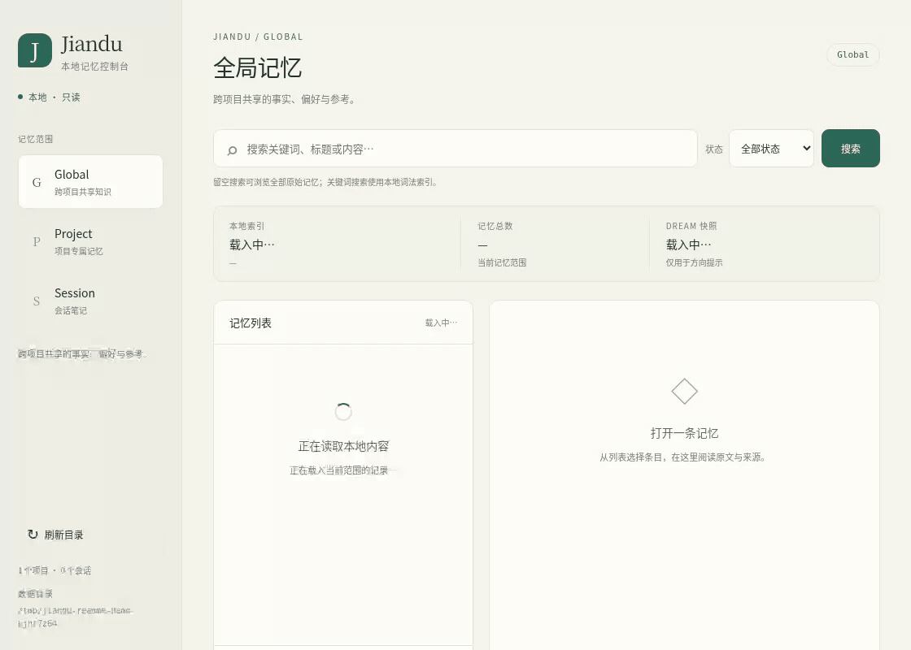

# Jiandu 简牍

[English](README.md) · [简体中文](README.zh-CN.md)

**One shared memory for all your coding agents.** Claude Code, Codex, Cursor
and Claude Desktop can read and write the same local memory store, so a
decision recorded in one tool can be recalled in the next. No vector database
and no embedding API: recall is deterministic BM25 search with CJK support over
local files.

[Releases](https://github.com/bigduu/Jiandu/releases/latest) · Part of [Bodhi](https://github.com/bigduu/Zenith) · [Bodhi desktop app](https://github.com/bigduu/Bodhi-AI/releases/latest) · [MIT](LICENSE)

- **Three scopes:** Project (decisions shared by agents on one project),
  Session (resume a workstream) and Global (facts useful across projects).
- **One MCP tool, 19 actions:** query, get, write, merge, rebuild, Dream
  orientation snapshots and more, behind a single `memory` tool.
- **Your data stays in plain files:** one data directory you choose; Jiandu
  never calls a model or a remote service.
- **Local console + per-call identity (v0.3.0):** `jiandu ui` browses what your
  agents remember; hosts can pass Project/Session identity per MCP call.
  Latest release: **v0.3.0** —
  [Releases](https://github.com/bigduu/Jiandu/releases/tag/v0.3.0).

<p align="center"></p>

[Static image](docs/demos/memory-console.png) · [Reproduce the MCP write and browser lookup](docs/demos/reproduction.md)

Real Linux Chromium capture of the read-only console (ships in **v0.3.0**). The
clearly labelled demo memory was written through actual stdio MCP before
recording. The browser searches and opens it; it does not write memory or run a
model. No personal memory store was used.

## Install

Published **v0.3.0** (Homebrew and source builds need Rust 1.95 or newer;
Homebrew installs Rust as a build dependency):

```sh
# Homebrew (compiles the v0.3.0 source tag) — recommended for v0.3.0
brew tap bigduu/tap
brew install bigduu/tap/jiandu

# crates.io is still at 0.2.0 until `cargo publish` for 0.3.0; for v0.3.0 use
# Homebrew above or build from the v0.3.0 tag / this checkout.
# cargo install jiandu-mcp --version 0.2.0 --locked   # crates.io (0.2.0 only)
```

The binary is called `jiandu`. Check it with `jiandu --help`. Installing does not
start a service or configure any MCP client. Run `which jiandu` for the absolute
path (Homebrew: usually `/opt/homebrew/bin/jiandu` on Apple Silicon,
`/usr/local/bin/jiandu` on Intel Macs).

## Connect your agents

To share Project memory, start every client with the **same `--data-dir`** and
the **same `--project-id`**. Give each client its own `--session-id` (optional
default from v0.3.0; still recommended so Session memory stays separate). IDs may contain letters,
digits, `-` and `_`. Replace `/Users/you` with your home directory; JSON and
TOML do not expand `~`.

**Claude Code:**

```sh
claude mcp add --scope user jiandu -- /opt/homebrew/bin/jiandu \
  --data-dir "$HOME/.jiandu" --project-id my-app --session-id claude-code
```

**Codex** (`~/.codex/config.toml`):

```toml
[mcp_servers.jiandu]
command = "/opt/homebrew/bin/jiandu"
args = ["--data-dir", "/Users/you/.jiandu", "--project-id", "my-app", "--session-id", "codex"]
```

**Cursor** (`~/.cursor/mcp.json`) / **Claude Desktop** (`claude_desktop_config.json`):

```json
{
  "mcpServers": {
    "jiandu": {
      "command": "/opt/homebrew/bin/jiandu",
      "args": ["--data-dir", "/Users/you/.jiandu", "--project-id", "my-app", "--session-id", "cursor"]
    }
  }
}
```

With generic MCP clients, one process serves one Project. Without `--project-id`, generic MCP clients can
use only Global memory: Project actions fail on purpose rather than guessing.
For several projects, add one server entry per project, or give each project its
own `.cursor/mcp.json` / `claude mcp add --scope project` entry.

Try: in one agent, *"Remember in project memory that we deploy on Fridays
only."* Then, in another agent connected to the same project: *"When do we
deploy?"* On a new data directory the first query reports a missing lexical
index; the agent should run `rebuild` for that scope and query again.

## Choose a version

| Path | Available workflow |
| --- | --- |
| [Published v0.3.0](https://github.com/bigduu/Jiandu/releases/tag/v0.3.0) (Homebrew / source tag) | Shared memory over stdio MCP, Dream snapshots, Bamboo import, read-only browser console (`jiandu ui`), and per-call host identity (`--session-id` / `--project-id` optional defaults). |
| `main` (tip of development) | Whatever lands after v0.3.0 — build from source for unreleased work. |
| crates.io `0.2.0` | Still the latest on crates.io until 0.3.0 is published there; lacks the console and per-call identity. |

Rust 1.95 or newer is required to build. [Audit evidence](docs/readme-audit.md).

Jiandu owns one authoritative data root, normally `~/.jiandu`. Bamboo native
memory and every MCP client must use that same Jiandu-owned root after cutover;
`~/.bamboo` must not remain a second authoritative durable-memory store.

## Components

- `jiandu-memory` provides persistence, maintenance, and lexical/BM25/CJK recall.
- `jiandu-mcp` exposes the store over stdio as one MCP tool named `memory`.
  Its `action` argument selects one of 19 memory operations.
  The same binary also serves the local read-only browser console.

## Memory scopes

- **Session** is temporary continuity for one host-identified agent workstream.
- **Project** is durable knowledge shared by agents working on the same project.
  The MCP host grants each call access with a stable, opaque `project_id`.
- **Global** is durable knowledge that is genuinely useful across projects.

## Build from source and generic configuration

For a source build of the current checkout (or the `v0.3.0` tag):

```shell
cargo build --release --locked -p jiandu-mcp --bin jiandu
```

Use the absolute path to the resulting `target/release/jiandu` binary.
From v0.3.0, only `--data-dir` is required; `--project-id` and `--session-id` are
optional defaults for clients that cannot send Jiandu context metadata (see
[Host integration](#host-integration-per-call-identity)). This
minimal configuration is enough for Global memory:

```json
{
  "mcpServers": {
    "jiandu": {
      "command": "/absolute/path/to/Jiandu/target/release/jiandu",
      "args": [
        "--data-dir", "/absolute/path/to/.jiandu"
      ]
    }
  }
}
```

Older **v0.2.0** binaries (including current crates.io) still require
`--session-id`; use the [Connect your agents](#connect-your-agents) snippets for
those builds.

The host may namespace the tool as `mcp__jiandu__memory`. For a first trial,
use a new dedicated data directory and Global memory, which needs no identity
context. Ask the host to query, write one confirmed non-sensitive cross-project
fact, then query it from another connection to the same root. A fresh root has
no lexical index: if the first query reports `lexical index is missing`, call
`rebuild` for that same scope, then retry the query before writing. Rebuild only
in response to that diagnostic. These are separate `memory` tool calls:

```json
{"action":"query","scope":"global","query":"fictional user language preference"}
```

If that first call reports the missing-index diagnostic, run:

```json
{"action":"rebuild","scope":"global"}
{"action":"query","scope":"global","query":"fictional user language preference"}
```

After the query succeeds:

```json
{"action":"write","scope":"global","type":"user","title":"Fictional user language preference","content":"This fictional demo user prefers replies in English across projects."}
{"action":"query","scope":"global","query":"fictional user language preference"}
```

These calls use deliberately fictional demo data. In a host configured to supply
Jiandu's Project/Session context, the ordinary tool calls also omit identity
fields:

```json
{"action":"query","scope":"project","query":"release decision"}
{"action":"session_read"}
```

Project actions fail if Project context is missing; `session_*` actions fail if
Session context is missing. They do not invent identities or silently fall back
to Global. Ask the host integrator to supply the missing context; do not move
project-specific facts into Global to bypass this boundary. A generic MCP host
must explicitly implement the Jiandu metadata extension before these contextual
calls work without dedicated-process defaults.

### Host integration: per-call identity

Only `--data-dir` is required to connect. Global memory needs no Session or
Project identity. One connection can serve multiple projects and workstreams:
the host supplies identity separately for each `tools/call` request, outside
model-generated tool arguments:

```json
{
  "name": "memory",
  "arguments": {"action":"query","scope":"project","query":"release decision"},
  "_meta": {
    "io.github.bigduu.jiandu/context": {
      "project_id": "project-1",
      "session_id": "agent-session-1"
    }
  }
}
```

This is the `params` object of a `tools/call` request. The metadata key is a
Jiandu extension that the host must explicitly support and populate; MCP does
not automatically provide current Project or Session identity. Project actions
require a host-authorized `project_id`; `session_*` actions require a host
`session_id`. Either field can be omitted when the operation does not need it.
`project_key` in tool arguments can only assert the current host Project and
cannot grant access. Use a distinct Session id for each independent workstream.

Host integrators may configure dedicated-process defaults when their client
cannot supply this metadata. For a process dedicated to one workstream,
`--session-id <ID>` and
`--project-id <ID>` remain optional startup defaults. A per-call context replaces
both defaults completely; `{}` explicitly clears them for that call. Context
is never retained between calls, and malformed context is rejected instead of
falling back to defaults. Clients without this metadata support can use Global
memory or those fixed defaults.

Rust hosts can construct `MemoryExecutionContext::default()` and use
`MemoryServer::execute_with_context` to provide a trusted context per invocation.
See the [per-call identity design](docs/design/mcp-call-context.md) for resolution,
authority, and compatibility details. Agents sharing Project memory use the
same data directory and Project identity. Query before writing, keep durable
items concise, and never edit Jiandu's data files directly.

## Local console

```shell
jiandu ui
# Or select the same canonical root used by your agents:
jiandu ui --data-dir /absolute/path/to/.jiandu --port 9123
```

Open the printed `http://127.0.0.1:<port>/` URL. The default root is `~/.jiandu`
and port `0` asks the OS for an available port. No Session or Project identity
is required. Press Ctrl-C to stop; the command serves only IPv4 loopback.

Browse Global knowledge, switch first-class Projects, or select persisted
Sessions. Search and page memories, filter their status, and read their full
content, tags, timestamps and provenance. Durable scopes also show lexical-index
availability and Dream snapshot freshness/content. Sessions show temporary
notes and are not assigned to a Project by inference.

The console uses the existing MemoryStore and bundled assets, without a
separate frontend build or agent runtime. It does not write records, access
signals, indexes, Session state or Dream snapshots. A missing/invalid index
still permits blank-query browsing; rebuild it through the existing authorized
memory tool when needed. This version has no edit, rebuild or Dream-generation
controls, and lists only first-class Projects rather than legacy directories.
See the [console design](docs/design/local-console.md).

## Optional agent Skill

The canonical [`jiandu-memory` Skill](skills/jiandu-memory/SKILL.md) teaches a
host model the lowest-cost query/get/write, Dream, and deterministic maintenance
workflows. It is optional: Jiandu's live MCP description, schema, and structured
responses remain the correctness contract when the Skill is absent.

Copy or symlink the canonical `skills/jiandu-memory/` directory into one native
host location:

| Host | Personal | Repository |
| --- | --- | --- |
| Codex | `$HOME/.agents/skills/jiandu-memory/` | `$REPO_ROOT/.agents/skills/jiandu-memory/` |
| Claude Code | `~/.claude/skills/jiandu-memory/` | `$REPO_ROOT/.claude/skills/jiandu-memory/` |

The host discovers and activates the Skill under its own permission model;
Jiandu does not install or enable it. See the official
[Codex Skill locations](https://developers.openai.com/codex/skills#where-codex-loads-local-skills)
and [Claude Code Skill locations](https://code.claude.com/docs/en/slash-commands#where-skills-live).

## Dream orientation

Dream is one compact host-generated orientation snapshot for Global memory and
each authorized Project. It is derived prose, not canonical truth, and never
enters topic counts, lifecycle operations, or lexical recall.

First call `dream_read`. It returns a missing cold state or the current snapshot,
plus the canonical-memory `current_generation` and an advisory `stale` flag. A
host that owns a model, prompt, cadence, and budget may synthesize up to 12,000
characters of Markdown, then call `dream_publish` with the generation observed
before synthesis began:

```json
{
  "action": "dream_publish",
  "scope": "project",
  "source_generation": "<current_generation from dream_read>",
  "content": "## Current orientation\n\n- ..."
}
```

Jiandu publishes the body and metadata atomically and rejects the result if
canonical memory changed meanwhile. A missing generation marker after upgrading
an existing store requires one `rebuild` for that authorized scope. For factual
decisions, always use `query`/`get` and current tools; Dream is only a cheap first
orientation. Jiandu never selects or calls a model/provider and does not schedule
Dream generation.

## One-time import from Bamboo

Before Bamboo switches its native memory store to the Jiandu root, stop Bamboo
memory writes or take a static snapshot. The destination must be absent or an
empty directory and must not be inside the Bamboo source:

```shell
jiandu import-bamboo \
  --source-data-dir /absolute/path/to/.bamboo \
  --data-dir /absolute/path/to/.jiandu
```

The command reads the Bamboo source without modifying it. It imports only the
current canonical durable topics under `memory/v1/scopes/global/topics/*.md`
and `projects/<ProjectId>/memory/v1/topics/*.md`; Session notes, Dream/Ledger/
plan data, indexes, views, logs, locks, state, and migration administration are
not copied. Every topic is validated before a sibling staging store is built,
then rendered once through Jiandu's current typed schema so retired metadata such
as `embedding_ready` does not become new Jiandu state. Each imported scope is
rebuilt once, and the completed store is published only after the raw source and
current-schema staged identities match their validated expectations. The JSON
result reports scanned/imported/failed counts plus separate SHA-256 identities
for the raw source topic paths/bytes and imported current-schema paths/bytes.
The command never deletes the Bamboo source and refuses to overwrite an
initialized Jiandu root.

After a successful cutover, Bamboo should construct its native
`jiandu-memory::MemoryStore` with this Jiandu-owned root. Other agents should
launch `jiandu` over stdio with the same `--data-dir`; do not dual-write or keep
using the Bamboo source as a fallback memory root.

## Host integration

Bamboo can use `jiandu-memory` directly and optimize recall while assembling
its dynamic context. Ranking, prompt placement, and token budgeting remain
Bamboo responsibilities. Bamboo also owns Dream synthesis prompts, model choice,
cadence, failure policy, and prompt placement; Jiandu only persists the resulting
generation-stamped snapshot. Other agents use `jiandu-mcp` as shared memory
without depending on Bamboo runtime types.

## Verify

```shell
cargo fmt --all -- --check
cargo metadata --locked --all-features --format-version 1
cargo clippy --workspace --all-targets --all-features --locked -- -D warnings
cargo test --workspace --all-targets --all-features --locked
```

Jiandu is licensed under the [MIT License](LICENSE).

### Source coverage and confidence

New durable writes omit `confidence` to mean unknown/unconfirmed. Model extraction,
append, split, and consolidation do not establish confirmation; rewritten content
cannot inherit a legacy rating. Existing `high`/`medium`/`low` values remain readable
as historical ratings and retention hints, not evidence of user or host approval.
No destructive migration or new schema version is needed.

Native hosts may use `write_memory_with_retrieval_and_source_range` with a validated
host Session ID and an ordered, unique list of message IDs actually supplied to the
extraction. The store validates the bounded ID shape; the host must verify Session
and input membership because Jiandu does not own the host transcript. The existing
`sources[].message_range` records input coverage, not an inclusive interval, exact
claim citations, or proof of truth. An empty range means the mapping is unknown.
Model-facing MCP arguments cannot provide source identity, ranges, confidence, or
confirmation. Host metadata retains the existing Session/Project authority rules.
