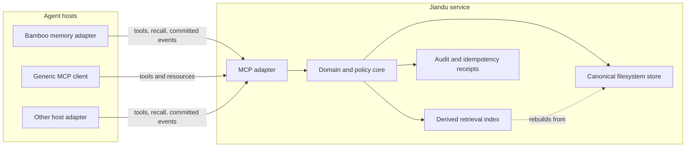

# Architecture

## Decision

Jiandu is a standalone service that exclusively owns a filesystem-backed memory store and exposes it through MCP. Agent runtimes integrate as clients. They do not link Jiandu's persistence implementation, write its files, or delegate prompt construction to Jiandu.

This boundary makes the memory portable across Bamboo and other MCP-capable hosts while keeping a single authority for consistency, migration, retention, and audit behavior.

## Goals

- Share durable memory across independent agent hosts through an open protocol.
- Keep canonical records inspectable, exportable, and recoverable without a model provider.
- Preserve explicit Principal, Project, Session, and operator-global scopes.
- Support deterministic local retrieval before adding optional semantic retrieval.
- Make writes concurrency-safe, idempotent, revisioned, and auditable.
- Let hosts choose whether memory is model-invoked, proactively recalled, or maintained from committed events.
- Degrade safely when memory is unavailable.

## Non-goals

- Defining a universal system prompt or agent plugin runtime.
- Replacing a host's authorization, token budgeting, prompt cache, or conversation store.
- Treating workspace paths as stable project identity.
- Requiring an LLM for storage, lookup, validation, import, or export.
- Supporting multiple processes that independently write the same data directory.
- Silently ingesting every draft, tool stream fragment, or uncommitted user message.

## System boundary



### Agent-neutral core

The core defines ordinary Rust structs, enums, and narrow traits for records, scopes, provenance, queries, mutations, revisions, and policy decisions. It contains no Bamboo session types, prompt fragments, or model-provider abstractions.

### Canonical filesystem store

The store is the source of truth. It provides:

- exclusive process ownership of a data directory;
- atomic record replacement and transaction recovery;
- optimistic concurrency through `expectedRevision`;
- idempotency receipts for retried mutations;
- schema and store-format migrations;
- tombstones, audit entries, import, export, and validation.

Human inspection is supported. Direct mutation is not part of the public consistency contract; changes should go through MCP or the administrative CLI.

### Derived index

The first index is deterministic lexical retrieval over canonical records and metadata. It can always be deleted and rebuilt from the store. Embeddings and semantic reranking may be added behind optional capabilities later; they cannot become required for basic operation.

### MCP adapter

The MCP layer translates protocol requests into authenticated domain commands. It exposes structured read and mutation operations, resources for addressable records, capability metadata, and stable domain errors. MCP protocol-version negotiation remains separate from the Jiandu API and store-format versions.

### Administrative CLI

The `jiandu` binary is both the service entry point and the operator interface. Planned commands include:

```text
jiandu serve
jiandu status
jiandu validate
jiandu rebuild-index
jiandu export
jiandu import
jiandu doctor
```

Administrative operations use the same core commands as the MCP adapter. They do not bypass validation or revision rules.

## Integration flows

### 1. Explicit model tools

Any compatible client can expose Jiandu tools to a model. The model explicitly searches, reads, remembers, updates, or forgets records within the permissions granted by its host.

```text
model -> host -> MCP tool -> Jiandu -> structured result -> host -> model
```

This is the minimum interoperability level and requires no agent-specific plugin.

### 2. Proactive host recall

A host adapter can query Jiandu before a model call using the authenticated identity and current Project/Session context. It then turns selected structured records into a dynamic context block under its own token, trust, and prompt-cache policies.

```text
host context -> memory_search -> records -> host selection/budget -> dynamic prompt context
```

Jiandu never returns an instruction to modify the system prompt. Stored memory is untrusted data and must remain visibly separated from trusted host policy.

### 3. Committed-event ingestion

A deeper integration can submit durable lifecycle events after the host has committed a message or branch transition. This enables automatic extraction, consolidation, or lineage maintenance without coupling Jiandu to a particular conversation database.

Event ingestion is a later milestone. The initial service remains complete and useful with explicit tools and host-driven recall alone.

## Deployment model

### Local-first service

The first supported topology is one long-running Jiandu daemon bound to loopback and serving MCP over Streamable HTTP. A host launches or discovers the daemon, authenticates, and connects as a client.

A compatibility `stdio` command may proxy to that daemon. It must not open the canonical store as an independent writer. This preserves MCP client compatibility without creating one writer per agent process.

### Remote service

Remote deployment is deferred until the local contract is stable. It will require TLS, explicit tenant isolation, an external authentication mechanism, quotas, backup policy, and an operator-defined trust boundary. A local path must never be accepted as remote identity.

## Consistency and lifecycle

On startup, Jiandu:

1. resolves and validates the configured data directory;
2. acquires an exclusive lock and records instance metadata;
3. checks the store format and completes or rolls back interrupted transactions;
4. validates index compatibility and schedules a rebuild if needed;
5. starts the authenticated MCP transport;
6. reports readiness only after the store is safe to serve.

Every successful mutation receives a monotonically increasing record revision and an opaque ETag. Retried requests with the same principal, operation, and idempotency key return the original result. Conflicting reuse of a key is rejected. Updates with a stale expected revision fail without overwriting newer data.

Shutdown stops accepting new mutations, drains bounded in-flight work, flushes durable receipts, and releases the store lock. Crash recovery relies on write-ahead transaction manifests, same-filesystem temporary files, atomic rename, and startup reconciliation.

## Security model

- Authentication establishes `principal_id` and `client_id`; models cannot choose them in tool arguments.
- Authorization evaluates operation, scope, target record, and client capability.
- A client receives the least context required for the current request.
- Stored text is treated as untrusted content, never as service or host policy.
- Secrets are rejected or redacted according to operator policy; Jiandu is not a credential vault.
- Mutations and administrative reads produce secret-safe audit entries.
- Destructive operations are narrow. Public `memory_forget` targets exactly one record; bulk purge is administrative.
- File permissions, hard-link counts, symlink handling, traversal checks, and data-directory ownership are validated on opened handles. Store I/O remains beneath one fixed root-directory capability rather than re-resolving ambient paths.

## Failure policy

| Failure | Jiandu behavior | Expected host behavior |
| --- | --- | --- |
| Service unavailable | No partial result is fabricated. | Continue without recalled memory or fail explicitly according to host policy. |
| Store lock held | Startup fails with the owning-instance metadata. | Connect to the existing daemon; do not start another writer. |
| Revision conflict | Mutation fails with the current revision metadata. | Re-read, reconcile, and retry with a new idempotency key. |
| Index missing/corrupt | Mark index degraded and rebuild from canonical records. | Basic exact reads remain available; search capability reports degradation. |
| Record invalid | Fail the read with path-free validation diagnostics; move it only through an explicit operator quarantine action. | Do not inject the invalid record; ask an operator to validate/quarantine it. |
| Client disconnects | Complete or roll back according to the transaction boundary. | Retry safely with the same idempotency key. |

## Observability

Jiandu emits structured, secret-safe logs and metrics for request latency, error codes, mutation conflicts, idempotent replays, store revisions, index health, rebuild progress, and recovery activity. A correlation ID follows a request from transport through core, store, and audit records.

Record bodies, user queries, credentials, and prompt text are excluded from logs by default.

## Independent version domains

The following versions evolve independently and must never be conflated:

1. MCP protocol revision negotiated by the transport.
2. Jiandu public API contract, beginning with `v1alpha1`.
3. Canonical store format.
4. Derived index format.
5. Host adapter version, such as the Bamboo integration.

Compatibility policy and migration tooling are defined for each boundary before it reaches a stable major version.

## References

- [MCP architecture](https://modelcontextprotocol.io/docs/learn/architecture)
- [MCP server features](https://modelcontextprotocol.io/specification/2025-11-25/server)
- [MCP tools](https://modelcontextprotocol.io/specification/2025-11-25/server/tools)
- [MCP resources](https://modelcontextprotocol.io/specification/2025-11-25/server/resources)
- [MCP lifecycle and version negotiation](https://modelcontextprotocol.io/specification/2025-11-25/basic/lifecycle)
