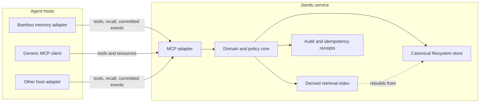

# Architecture

## Decision

Jiandu is a standalone service that exclusively owns a filesystem-backed memory store and exposes it through MCP. Agent runtimes integrate as clients. They do not link Jiandu's persistence implementation, write its files, or delegate prompt construction to Jiandu.

This boundary makes the memory portable across Bamboo and other MCP-capable hosts while keeping a single authority for consistency, migration, retention, and audit behavior.

## Goals

- Share durable memory across independent agent hosts through an open protocol.
- Keep canonical records inspectable, exportable, and recoverable without a model provider.
- Preserve explicit Principal, Project, Session, and operator-global scopes.
- Support deterministic local retrieval before adding optional semantic retrieval.
- Make writes concurrency-safe, idempotent, revisioned, and auditable.
- Let hosts choose whether memory is model-invoked, proactively recalled, or maintained from committed events.
- Degrade safely when memory is unavailable.

## Non-goals

- Defining a universal system prompt or agent plugin runtime.
- Replacing a host's authorization, token budgeting, prompt cache, or conversation store.
- Treating workspace paths as stable project identity.
- Requiring an LLM for storage, lookup, validation, import, or export.
- Supporting multiple processes that independently write the same data directory.
- Silently ingesting every draft, tool stream fragment, or uncommitted user message.

## System boundary



### Agent-neutral core

The core defines ordinary Rust structs, enums, and narrow traits for records, scopes, provenance, queries, mutations, revisions, and policy decisions. It contains no Bamboo session types, prompt fragments, or model-provider abstractions.

### Canonical filesystem store

The store is the source of truth. It provides:

- exclusive process ownership of a data directory;
- atomic record replacement and transaction recovery;
- optimistic concurrency through `expectedRevision`;
- idempotency receipts for retried mutations;
- schema and store-format migrations;
- tombstones and audit entries;
- bounded side-effect-free validation and deterministic authorized portable
  export; and
- deterministic import planning, all-or-none batch import, and receipt-bound
  recovery-safe backup metadata.

Human inspection is supported. Direct mutation is not part of the public consistency contract; changes should go through MCP or the administrative CLI.

### Derived index

The first index is the implemented `jiandu-index` deterministic lexical
retrieval layer over canonical records and metadata. One operator-only
`memory:admin:rebuild_index` capability asks `CanonicalStore` for a path-free,
all-or-error, all-store record snapshot at one watermark. This creates a single
all-store derived index; it is not a tenant-view cache whose first caller can
permanently omit other scopes. The store remains authoritative and does not
depend on this crate.

Ordinary queries receive an `AuthorizedIndexQuery` minted by the store from
fresh host authority and the exact requested selectors. The capability carries
private resolved scopes plus a fingerprint of the complete authority. The
index first verifies its complete private image, then emits hits only from the
intersection represented by that capability. Public cursors bind this full
authority fingerprint, normalized query/filters, store/index watermarks, and a
host-held HMAC key; an authorization change invalidates an old cursor instead
of widening it.

The fixed private `index/lexical.sqlite` file is published through a held
directory capability: SQLite closes and syncs the build image, the index copies
it into a create-new same-directory temporary, rechecks target identity, and
uses a capability-relative cross-platform atomic rename. Ambient directory or
target replacement races fail without redirecting writes. Missing, corrupt,
incompatible, or stale images produce a path-free degraded diagnostic under
the operator-only index capability and can be rebuilt. They never block
`CanonicalStore::get` or deterministic list reads. Embeddings and semantic
reranking may be added behind optional capabilities later; they cannot become
required for basic operation. The format, weights, tokenizer, cursor boundary,
and compatibility policy are in [Lexical Index Format `v1alpha1`](index-format-v1alpha1.md).

### MCP adapter

The implemented `jiandu-mcp` crate translates MCP `2025-11-25` read and
single-record mutation requests into authenticated domain operations. A
per-connection constructor validates the trusted context, principal equality,
and `memory:read` grant, then retains a private-field `AuthorizedRead`;
identity is never accepted from a tool argument. Its fixed tools are
`memory_search`, `memory_get`, `memory_list`, `memory_remember`,
`memory_update`, and `memory_forget`. Checked core request schemas are used
directly, and structured Jiandu envelopes remain authoritative over concise
text summaries.

The handler depends on narrow synchronous `McpReadBackend` and
`McpMutationBackend` seams rather than owning daemon lifecycle. The production
backend composes `CanonicalStore` behind a host `RwLock` with `LexicalIndex`, so
reads and mutations share one writer without coupling the adapter to a daemon
lock strategy. Search reads the canonical watermark before and after the index
result and discards any mixed snapshot. A fresh mutation changes a ready index
to degraded until rebuild; a missing index remains missing. In either case
search yields `INDEX_DEGRADED` while exact get/list remain independent.

Mutation-enabled construction retains trusted connection context, a host
chosen `CreationActor`, and a synchronous bounded admission policy beside the
backend. `memory:write:{scope-kind}` grants independently authorize remember
and update; `memory:forget:{scope-kind}` independently authorizes forget.
Read-only construction remains valid and all three mutation tools return a
zero-I/O `FORBIDDEN` envelope instead of making connection initialization
fail. Mutation calls execute in a blocking worker because canonical sync and
rename boundaries are synchronous. An MCP cancellation or transport timeout
marks the response unused but does not cooperatively abort a worker after WAL
work has begun; the client retries the identical command and key to recover
the old-or-complete result.

Conformance has two complementary exhaustive matrices. Store tests fail and
reopen at every create/update/forget persistence and recovery boundary.
In-process MCP tests use the same authoritative live-boundary lists, pause the
blocking worker at every boundary, send a real `notifications/cancelled`, then
release, close the owner, reopen, and retry the same key. Together they prove
transport cancellation never becomes a second commit and crash recovery never
fabricates an acknowledgement.

The public black-box service matrix adds two independent clients around those
lower layers. It races CAS, idempotency, and exact-scope checks; discards one
successful mutation response body before restarting and replaying its durable
key; deletes and corrupts only an isolated disposable index before rebuilding
byte-identical index bytes and identical public results; and proves a
contending daemon cannot alter the owned store. Complete service absence
produces a transport failure rather than a fabricated memory envelope. This
matrix does not define the bounded active-session drain policy reserved for
Issue #29.

Addressable resources use only opaque IDs or scope selectors, never queries or
paths. Inaccessible and absent IDs are indistinguishable. Initialization
metadata contains only closed ready/degraded/missing states and derived
operation flags; it does not call admin diagnostics or expose reasons, counts,
watermarks, or paths. The `jiandu-service` crate now owns the separate HTTP,
authentication, and daemon-lifecycle boundary described below; subscriptions
and prompt placement remain later work. MCP protocol negotiation remains
separate from the Jiandu API and store-format versions.

### Service CLI

The shipped binary surface is intentionally only:

```text
jiandu serve --config <local-config.json>
```

The argument is a bounded regular local JSON file, not inline JSON, standard
input, a raw bearer token, or an environment-variable credential. The current
command opens one already initialized store; it never falls back to
`CanonicalStore::initialize`. `status`, validation, rebuild, import/export,
doctor, and other administrative commands remain Issue #30. Administrative
mutations will use the same core commands as the MCP adapter and will not
bypass validation or revision rules.

### Read-only validation and portable export

The canonical store has one pure inspection engine with two coordination
paths. A live daemon borrows its already-owned `CanonicalStore` root and lock;
an offline `ReadOnlyStoreInspector` acquires the same kernel lock without
rewriting owner diagnostics and therefore runs only while the daemon is
stopped. Neither path initializes, migrates, recovers, quarantines, repairs, or
publishes anything.

Both paths bind the beginning and ending store/audit watermarks, root and lock
identity, opened file identity, and directory entry sets. A supported stable
snapshot yields canonical, byte-deterministic output. Active WAL, ambiguous
private ledger state during an admin whole-store operation, concurrent
replacement, unsupported export source, or a bounded validation finding
refuses export rather than producing a normalized or mixed bundle.

Scoped inspection traverses and decodes record/tombstone contents only beneath
explicitly authorized owner segments. To preserve the v3/v4 global
non-resurrection guarantee, it separately performs one bounded, namespace-only
collection of domain-separated tombstone storage keys before opening any
authorized candidate body. That pass checks strict entry names and filesystem
type/link/permission metadata without opening a tombstone. It never decodes or reports an unauthorized
tombstone's scope, ID, metadata, or count. Whole-store validation/export require
distinct private-field admin capabilities and grants. Full output, format,
bound, and compatibility rules are specified in
[Validation Report and Portable Export `v1alpha1`](portable-export-v1alpha1.md).
Private replay/audit/witness artifacts cannot be safely partitioned by memory
scope, so scoped inspection never traverses that ledger; its exact invariants
are checked only by the admin whole-store mode.

### Portable import and backup metadata

Portable import is a host/operator store API, not a model-visible MCP tool. It
strictly decodes the portable bundle before write and produces a deterministic,
side-effect-free plan from fresh exact-scope capabilities plus independent
`memory:import:*` grants. The plan classifies accepted, conflicting,
unauthorized, tombstone-protected, and oversized-invalid items without creating
a manifest or changing a watermark. Commit rechecks the plan and authority and
admits only a bounded, fully committable batch.

The v4 batch WAL stages every canonical record/tombstone and the body-free
backup/result/receipt/audit artifacts on their final filesystems, publishes all
targets, and advances `store.json` last. Any post-WAL failure poisons the live
handle. Startup either removes safe pre-publication staging and returns to the
old store, completes an exact published prefix, or fails closed; no partial
batch is serviceable. Principal/key/request digests provide exact retry before
fresh target conflict checks, so acknowledgement loss replays the original
result and backup metadata without another audit sequence.

Backup metadata is not a fallible callback or self-authorizing standalone
file. It is persisted and exact-set-bound by the same receipt/audit transaction,
returned in `ImportCommit`, and readable only through a separate
`memory:admin:backup_metadata` host capability with full ledger/file-identity
revalidation. Exact public codecs, bounds, privacy, and compatibility are in
[Portable Import and Backup Metadata `v1alpha1`](portable-import-v1alpha1.md);
layout, recovery, and migration are in
[Canonical Store Format `v1alpha4`](store-format-v1alpha4.md).

## Integration flows

### 1. Explicit model tools

Any compatible client can expose Jiandu tools to a model. The model explicitly searches, reads, remembers, updates, or forgets records within the permissions granted by its host.

```text
model -> host -> MCP tool -> Jiandu -> structured result -> host -> model
```

This is the minimum interoperability level and requires no agent-specific plugin.

### 2. Proactive host recall

A host adapter can query Jiandu before a model call using the authenticated identity and current Project/Session context. It then turns selected structured records into a dynamic context block under its own token, trust, and prompt-cache policies.

```text
host context -> memory_search -> records -> host selection/budget -> dynamic prompt context
```

Jiandu never returns an instruction to modify the system prompt. Stored memory is untrusted data and must remain visibly separated from trusted host policy.

### 3. Committed-event ingestion

A deeper integration can submit durable lifecycle events after the host has committed a message or branch transition. This enables automatic extraction, consolidation, or lineage maintenance without coupling Jiandu to a particular conversation database.

Event ingestion is a later milestone. The initial service remains complete and useful with explicit tools and host-driven recall alone.

## Deployment model

### Local-first service

The first supported topology is one long-running Jiandu daemon bound to an
explicit loopback `SocketAddr` and serving MCP over rmcp Streamable HTTP at the
fixed `/mcp` route. `jiandu serve` validates the complete trusted configuration
and rejects wildcard, unspecified, or non-loopback addresses before opening
the canonical data directory. It then opens and recovers one existing store,
classifies the disposable index, constructs one shared
`CanonicalReadBackend`, and only then publishes the listener. Every
authenticated connection uses that backend and therefore the same exclusive
store owner and writer lock.

The closed `jiandu.service.config/v0.1` local configuration contains only a
fixed `sha256:<64 lowercase hex>` bearer digest, trusted principal/client
identity, exact scopes, one typed permission profile, creation actor, and a
fixed `hmac-sha256:<64 lowercase hex>` cursor key. The raw bearer exists only
in an HTTP request. Operators must provision bearer values with at least 256
bits of cryptographic entropy; the transport's minimum-length check is not an
entropy estimator. The boundary requires exactly one well-formed
`Authorization: Bearer` value, hashes it, compares fixed-size digests in
constant time, removes the header before MCP dispatch, and selects a separate
session manager for that credential. Missing, multiple, malformed, or invalid
credentials receive the same cache-disabled fixed-body HTTP 401 before the MCP
handler factory runs. Authentication state is trusted host context and is
never merged into tool arguments.

The unauthenticated `/live` and `/ready` probe routes expose fixed closed JSON
only. Liveness means that the HTTP task is running. Readiness is published only
after store ownership, recovery/ledger validation, durability probing, index
classification, and backend construction. A missing or degraded disposable
index keeps canonical exact-read/list readiness true while search is false; it
does not terminate the process or expose a path, reason, count, or watermark.

An abbreviated configuration shape is:

```json
{
  "configVersion": "jiandu.service.config/v0.1",
  "bind": "127.0.0.1:9817",
  "dataDir": "/operator/selected/existing-store",
  "cursorMacKey": "hmac-sha256:<64-lowercase-hex>",
  "clients": [{
    "bearerTokenDigest": "sha256:<64-lowercase-hex>",
    "principalId": "prn_local_client",
    "clientId": "cli_local_client",
    "scopes": { "projectIds": [], "sessionIds": [], "instanceGlobal": false },
    "permissions": { "read": true, "write": ["principal"], "forget": [] },
    "creationActor": "host"
  }]
}
```

`read` is required by the fixed MCP surface. `write` and `forget` are separate
sets of the closed `principal | project | session | instance_global` scope
kinds. Each selected kind must have exact authority in `scopes`; duplicate
kinds or IDs and permission for an absent exact kind fail configuration. The
service derives `memory:read`, the exact `memory:write:*` and
`memory:forget:*` grants, and the mutation-policy scope union from this one
profile. Write and forget therefore remain independent without a second
operator-visible grant or policy source.

The v0.1 service defaults admit all six current memory types up to the core
65,536-byte body bound. Its closed secret-content policy is the existing
`AllowAllSecretContent`, meaning that the upstream trusted admission layer
supplies no additional secret detector; it is not a configurable daemon knob.
Core validation still applies, and Jiandu is not a credential vault. The
unreleased #28 `grants` and `mutationPolicy` fields are rejected as unknown;
there is no dual-schema compatibility mode.

A compatibility `stdio` command may proxy to that daemon. It must not open the canonical store as an independent writer. This preserves MCP client compatibility without creating one writer per agent process.

### Remote service

Remote deployment is deferred until the local contract is stable. It will require TLS, explicit tenant isolation, an external authentication mechanism, quotas, backup policy, and an operator-defined trust boundary. A local path must never be accepted as remote identity.

## Consistency and lifecycle

On startup, Jiandu:

1. resolves and validates the configured data directory;
2. acquires an exclusive lock and records instance metadata;
3. checks the store format and deterministically completes or rolls back the
   single interrupted transaction, failing closed on ambiguous state;
4. validates the exact mutation/import receipt/result/audit/backup/tombstone/
   logical-erasure-witness ledger against its independent audit watermark and
   rejects malformed, missing, foreign, or resurrected identities;
5. probes required file-sync and same-filesystem atomic-replace behavior and
   fails closed if the filesystem cannot provide it;
6. validates index compatibility into the closed ready/degraded/missing state;
7. starts the authenticated MCP transport;
8. reports readiness only after the store is safe to serve.

The implemented canonical mutation core gives every create/update success a monotonically
increasing record revision and content-bound opaque ETag, and every committed
create/update/forget one new store watermark, one durable receipt/private
result, and one sequence-addressed audit event; each committed portable-import
batch likewise advances target metadata and audit sequence exactly once. The
host first authenticates principal/client context and mints a nonempty,
operation-specific set of exact authorized scopes before private receipt
lookup. Receipt hits must bind a scope inside that set before result/audit or
the full fingerprint is read; receipt misses inspect only those scopes. This
lets update/forget resolve a model-supplied opaque ID without accepting its
scope or disclosing an inaccessible target. Identical
principal/operation/key/input retries return the original success even after
disconnect/restart and advance no watermark; conflicting reuse fails before
record lookup, CAS, policy, or a write. Fresh remember/update admission sees
the complete canonical target after CAS/target construction; fresh forget
admission sees only the validated command and never receives the old body. All
admission is local, synchronous, bounded, non-reentrant, panic-free, network-free, and
runs before the first WAL byte while the writer guard is held. Updates with a
stale expected revision otherwise fail without overwriting newer data and
disclose only the current revision.

Record/tombstone, backup metadata, result, receipt, audit, and metadata are one
pre-acknowledgement WAL transaction with metadata published last. Startup can rebuild missing
artifacts only from an exact target record and strict digest-bound intent. It
never guesses. Forget publishes and syncs its tombstone before renaming the
held canonical record to a private witness, truncating that held descriptor to
zero, syncing it, and retaining the verified zero-length witness; it then
commits body-free artifacts and metadata last. This is logical erasure, not a
claim that prior physical blocks or backups were securely erased. The explicit
`v1alpha2` to `v1alpha3` migration first recovers a v2 WAL and validates its
ledger, prepares/syncs tombstone layout, then publishes the new store-format
capability gate last. The explicit v3-to-v4 migration similarly recovers and
validates the v3 store before syncing import-ledger layout and publishing v4
metadata last, so older writers fail closed.

The current service cancellation path stops accepting transport work, cancels
active MCP sessions, waits for the HTTP task to stop, and then releases the
store lock. A bounded graceful-drain policy is deliberately deferred to Issue
#29. No fallible post-commit receipt callback exists:
receipt/result/audit durability is inside the same transaction that precedes a
success response. Crash recovery relies on strict write-ahead manifests,
same-filesystem temporary files, file and directory sync boundaries, atomic
replacement, and startup reconciliation. Any failure after write-ahead begins
poisons the current handle so stale in-memory metadata cannot be served before
restart recovery.

## Security model

- Authentication establishes `principal_id` and `client_id`; models cannot choose them in tool arguments.
- Authorization evaluates operation, scope, target record, and client capability.
- A client receives the least context required for the current request.
- Stored text is treated as untrusted content, never as service or host policy.
- Secrets are rejected or redacted according to operator policy; Jiandu is not a credential vault.
- Mutations and administrative reads produce secret-safe audit entries.
- Destructive operations are narrow. Public `memory_forget` targets exactly one record and requires `memory:forget:*`, which is separate from `memory:write:*`; bulk lifecycle planning requires a still-separate administrative grant and has no execution authority in this slice.
- File permissions, hard-link counts, symlink handling, traversal checks, and data-directory ownership are validated on opened handles. Store I/O remains beneath one fixed root-directory capability rather than re-resolving ambient paths.

## Failure policy

| Failure | Jiandu behavior | Expected host behavior |
| --- | --- | --- |
| Service unavailable | No partial result is fabricated. | Continue without recalled memory or fail explicitly according to host policy. |
| Store lock held | Startup fails with the owning-instance metadata. | Connect to the existing daemon; do not start another writer. |
| Revision conflict | Mutation fails with the current revision metadata. | Re-read, reconcile, and retry with a new idempotency key. |
| Index missing/corrupt | Mark index degraded and rebuild from canonical records. | Basic exact reads remain available; search capability reports degradation. |
| Record invalid | Fail the read with path-free validation diagnostics; move it only through an explicit operator quarantine action. | Do not inject the invalid record; ask an operator to validate/quarantine it. |
| Client disconnects | Complete or roll back the record/receipt/audit transaction according to its durable state. | Retry the identical operation with the same key and current exact-scope authority. |

## Observability

Issue #28 exposes only the closed liveness/readiness probes and secret-safe
startup errors. The complete structured logging, metric, and bounded shutdown
contract is deferred to Issue #29. For a fresh MCP mutation, a
domain-separated UUIDv4 correlation maps reversibly to the transaction ID
already bound by the strict WAL/result/receipt/audit codecs. Correlation is
excluded from the request fingerprint. An exact replay returns that original
durable operation correlation, including historical transaction IDs using any
canonical UUID version accepted by the existing store codecs; the fresh
UUIDv4 constraint is not reapplied to replay. The retry attempt's separately
generated correlation remains local to adapter/policy diagnostics and is not
persisted or added to the public envelope. Mutation failures carry the store
revision captured under the same writer guard; the adapter never performs a
racy second watermark read to build the error envelope.

Record bodies, user queries, credentials, and prompt text are excluded from logs by default.

## Independent version domains

The following versions evolve independently and must never be conflated:

1. MCP protocol revision negotiated by the transport.
2. Jiandu public API contract, beginning with `v1alpha1`.
3. Canonical store format.
4. Derived index format.
5. Host adapter version, such as the Bamboo integration.

Compatibility policy and migration tooling are defined for each boundary before it reaches a stable major version.

## References

- [MCP architecture](https://modelcontextprotocol.io/docs/learn/architecture)
- [MCP server features](https://modelcontextprotocol.io/specification/2025-11-25/server)
- [MCP tools](https://modelcontextprotocol.io/specification/2025-11-25/server/tools)
- [MCP resources](https://modelcontextprotocol.io/specification/2025-11-25/server/resources)
- [MCP lifecycle and version negotiation](https://modelcontextprotocol.io/specification/2025-11-25/basic/lifecycle)
